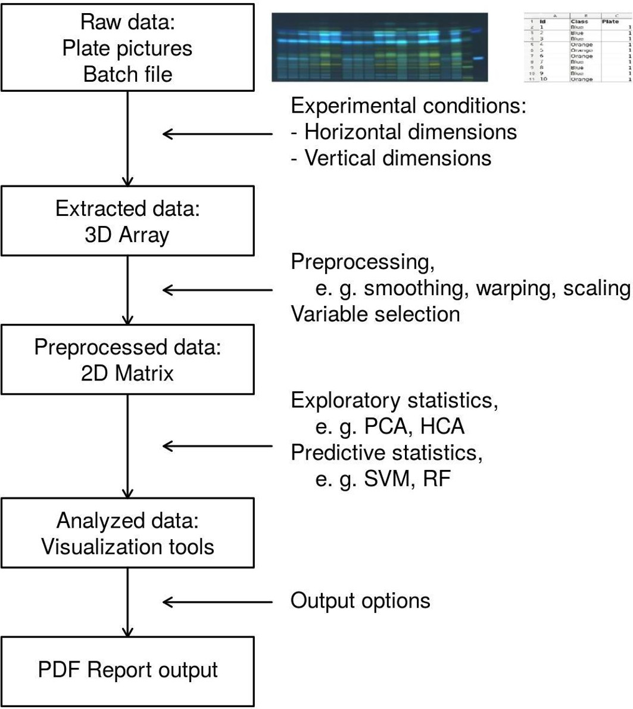

## Introduction

rTLC is a web application for image processing and multivariate analysis of HPTLC chromatograms.

Different features are available:

* Chromatograms extraction from pictures
* Chromatograms preprocessing
* Variables selection
* Exploratory statistics
  + PCA
  + Cluster
  + Heatmap
* Predictive statistics
  + Model training 
  + Parameters tunning
  + Cross validation
  + Regression/classification
  + New data prediction
*Report output

The application could be found at this url:
http://shinyapps.ernaehrung.uni-giessen.de/rtlc/

## Analytical pipeline

 

## Data input

 

### Chromatogram extraction

#### Demonstration data

 

In the tab _Data Input_, select one of the demo files in the _Data to use_ menu on the left (Figure 3).
A picture should appear on the page , as well as a _Plate choice_ menu and a table named _Horizontal dimension_.

#### Horizontal dimensions 

A chromatogram will be extracted between each pair of red and green vertical lines on the central image by taking the horizontal mean of pixels on each of the red, green and blue channels of the chromatogram. The gray scale is then calculated from the 3 channels at each Rf and for each track.

The number in the _Horizontal dimension_ table must be modified in order to match each band of the chromatogram between a pair of red and green lines. 

If the dimensions are available from the manipulation AND there wasn’t __unnecessary cropping__ of the image, this step should be straightforward. 
About the cropping, it is good practice to upload the totality of the images without a cropping that could be difficult to reproduce on other data in the future.
It is possible to choose two conventions for those dimensions, _i.e._ calculation from the center fo the band of from the exterior.
The _Edge cut_ parameter is here to control the zone of the band to extract, a value of 0 will extract all the band, whereas a bigger value will help to take only the center of the band.
This operation must be done for each plate of the study, the picture could be chosen in the _Plate choice_ menu on top of the central image. If the study contains three plates, there will be 3 choices in the drop-box menu and therefore, 3 rows in the _Dimension table_.
It’s possible to save a dimension table as an excel file to use later, for example with the same study but with pictures under a different light.

#### Vertical dimensions

The _Vertical dimension_ table is here to indicate the _Migration front_ value, the _Plate width_, the _Distance to lower edge_ as well as the _Pixel width_. Those values allow the software to redimension the chromatograms and attribute a _R_~F~ for each pixel.

#### Batch table

 

Visit the _Batch table_ to visualize the batch.
The table is editable and the _Exclude_ option allow to exclude samples, outliers or standard for example. The checkbox on the left concern the informations of the batch that should be passed to the _Track plot_ title. Finally, the _Column filter_ allow to exclude bigger part of the data set.

#### Track plot, Chromatogram comparison, Densitogram comparison

Those three tabs allow to visualize the extracted chromatograms.

#### Your own data

Now in the tab _Data input_, choose to use _Your own data_.
There are two parts:

* the independent variables: plate pictures with the band
* the dependent variables: batch file (in excel) with information on each band

You can upload your(s) plate(s) in the _Browse_ that appears on the left.
Proceed to the extraction like for the demonstration data.
For the batch, there are two choices, it’s possible to upload an excel file on the left side of the page or it’s possible to edit directly the batch file in the batch tab, the number of rows will correspond to the number of extracted chromatograms.
In case a excel file is uploaded, a few rules must be observed:

*The first row must be the name of the columns
*There must be the same number of rows (without the first one) as chromatograms extracted.

In case one of the constraints is not respected, a message will appear showing the user what is the problem.

#### Save the data extracted

In order to avoid the step of chromatogram extraction for a future session, it’s possible to save a file containing the chromatograms and the batch table with the Save Chromatograms button on the left of the page.
In another session, choose to use _Saved data_ in the tab _Data input_. And upload the file saved precedently in the browse button.

#### Save csv file for each channel

To export the chromatograms to another software for further exploitation, it’s possible to save each channel as a CSV file with observation as row and RF as column. The files use “;” as separator. The download buttons are on the left part of the page.

## Data preprocessing

 

This tab allows different preprocessing in order to prepare the data for further analysis.

#### Preprocess order

In the left side of the page, choose the order the preprocessing should appear.
Available preprocessing are:

* Smoothing: Savitzky-Golay transformation
* Warping: Peak alignment (experimental)
* Baseline correction
* Scaling
* Standard Normal Variate
* Mean centering

#### Preprocess details

For each preprocessing, a set of options are available, in each case, a link leads to an exhaustive explanation of the features.

#### Chromatogram comparison, Densitogram comparison
In these two tabs, you can visualize the results of the preprocessing. 

## Variables selection

 

This tab allows for variable selection in order to choose a channel or part of a channel. There are 20 possibilities to choose a channel, a range and to include or not this range in the study. After this step, all selected data are combined into one data set that will be used for statistical study. The two plots on the left should help the user to understand the feature.

## Exploratory Statistics

### PCA

 

This feature allows to perform PCA on the dataset.

#### PCA tab
The principal plot is the score plot, a few options are available:

* Choose the color/shape/label of the point according to one of the variable of the batch
* Choose the component to plot 
* Choose to calculate the ellipse and to plot it 
* Choose the color palette to use in the plot
* A few aesthetics parameters :
	+ _Horizontal adjustment_ and _Verticale adjustment_ move the label on the plot
	+ _Point size_ scales the point size on the plot
* Title of the plot 

On this page, there is also a table of the batch and the first 4 components of the analysis and a Summary of the model which shows the cumulative variables of the first 5 and the 10th components.

#### Loading Plot
This tab shows the loading plot of the PCA. 
It’s possible to choose the component to study and to plot or not the minimum and maximum point on the graph according to the _Span of local minima and maxima_. The resulting maximum and minimum values are shown in the field bellow.

#### Outlier
This tab is for outlier detection, i.e. points that should be removed because they are too different from the dataset.
It’s possible to choose the number of components of the PCA to include in the test and the quantile to use for the cutoff. The Mahalanobis distance is used and the classical and robust tests are calculated.

### Cluster

This feature allows to perform cluster analysis on the dataset.
The options available are:

* Choice of the variable of interest in the batch.
* Choice of the distance method (Euclidean is the most common).
* Choice of the cluster method (Ward is the most common).
* Number of clusters to cut the tree in.

### Heatmap
This feature allows to perform and visualize the heatmap, choose the variable of interest and visualize the result, either with the normal heatmap, or with the interactive heatmap.

## Predictive statistics
This tab allows you to train a predictive model for classification or regression.

 

### Training/Test split
In a first time, the data set should be split in two, the test set and the training set. The training set will be used to train the data and the test set will be used to verify the result of the training on an independent part of the dataset This option is present in the _Preprocessing_ tab as the split is applied before the preprocessing.

### Classification/Regression
Depending on the problem, one option should be chosen in order to train the system on the good type of data. 

### Choice of the variable of interest
Choose the variable to be trained with from the batch. What should be predicted. It must be in accordance with the Classification/Regression choices, otherwise an error will be returned, for example if regression is asked on non-numeric data.

### Algorythm
Choose which machine learning algorithm should be used, some of them are only available for classification or for regression. 
Only a subset of available algorithms is available, others could be added, just contact us. The list of all models available could be found here:
http://topepo.github.io/caret/modelList.html

### Tuning options
The training will try every combination of every parameters of the grid in order to optimize the performance of the model and choose the better parameters.

### Cross validation

* Validation method:
	+ Bootstrap
	+ Repeated cross validation
	+ Leave one out cross validation
* Summary metrics:
	Which summary metrics to use for the tuning
* Cross validation k-fold or resampling iterations:
	Number of k-fold or resampling
* Number to repeat (k-fold only):
	Number of times to repeat the validation process

### Grid
This area contains the tuning length, _i.e._ the maximum number of parameters to test on each parameters. It is also possible to choose the different parameters manually in the Grid table for fine tuning.

### Training itself
Once all the options are chosen, press the _Train_ button to launch the analysis, note that you must visit another tab to really launch the analysis.

### Validation Metrics
This tab is used to verify the performance of the model, a confusion matrix is shown for the classification problem and a plot of predicted values against the real value is shown for the regression problem.
It’s possible to choose to visualize the result for the Test data, the Training data and the cross-validation data, i.e. the data used during the optimization phase of the training.

### Prediction table
This tab shows the prediction table for all data, it’s possible to filter according to the use in the training set or not, to the prediction class etc… 

### Algorithm information
This tab gives more information about the algorithm used during the training, in particular, what are the tuning parameters.

### Model Summary

This tab summarizes important information of the tuning, it’s possible to extract the information for each row of the tuning grid and for each of the metrics.
Also important information describes how the tuning took place.

### Tuning Curve
This tab shows the evolution of the metric chosen for the tuning depending on each parameter of the algorithm.

#### Model Download and New data prediction

Once the good model with the good preprocessing, the good variable selection, the good tuning parameters is made. It’s possible to download a file that could be then uploaded at the beginning of the process. 
In the first tab _Data Input_, choose to use _Predicted data – QC_.
Upload the batch and picture file as previously and also a model file created in another session.
Proceed to the chromatograms extraction with the dimension table and visit the tab _Prediction (QC)_. The prediction for each chromatogram should appear.

## Report output

In this tab, it’s possible to download a report, choose the content of this document as well as the format. It is also possible in the right side to download the PCA data to use them in other software.

